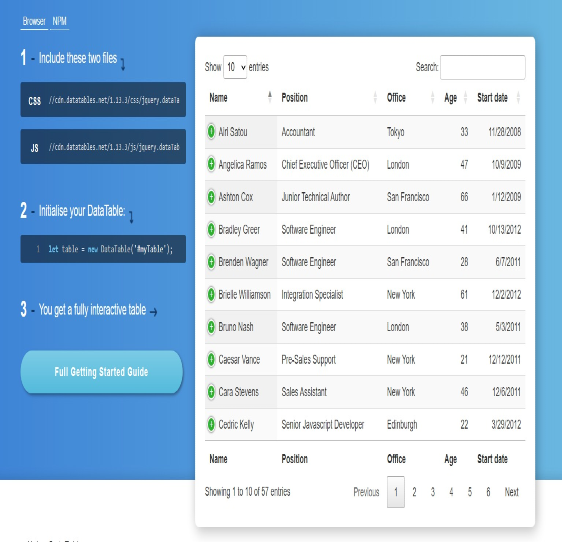

 

## Laravel-Vue.Js (Current: Laravel 8.* , Vue.Js: 3) ([Demo]())

 

[Tests](https://github.com/Zack4DEV/Project--VueJs-Laravel--./tree/advanced/tests?branch=advanced)

### Demo Credentials

**Admin:** root@root.com  
**Password:** root

**User:** user@user.com  
**Password:** user

### Introduction

Vue.js is a progressive, incrementally-adoptable JavaScript framework for building UI on the web.
 

Laravel is a web application framework with expressive, elegant syntax. We believe development must be an enjoyable and creative experience to be truly fulfilling. Laravel takes the pain out of development by easing common tasks used in many web projects.

### Used Technologies

#### [Vite](https://vitejs.dev/guide/)
About: Vite is a modern frontend build tool that provides an extremely fast development environment and bundles your code for production. When building applications with Laravel, you will typically use Vite to bundle your application's CSS and JavaScript files into production ready assets.
 

Laravel integrates seamlessly with Vite by providing an official plugin and Blade directive to load your assets for development and production.

##### [DataTables 2](https://datatables.net/manual/index)

 
About: DataTables is a plug-in for the jQuery Javascript library. It is a highly flexible tool, built upon the foundations of progressive enhancement, that adds all of these advanced features to any HTML table.
 

### License

MIT: [http://anthony.mit-license.org](http://anthony.mit-license.org)
